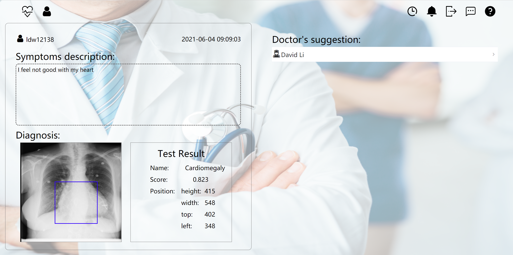
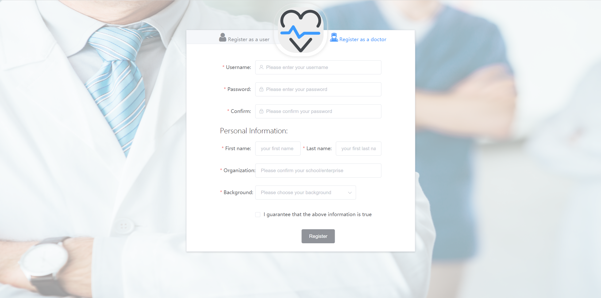
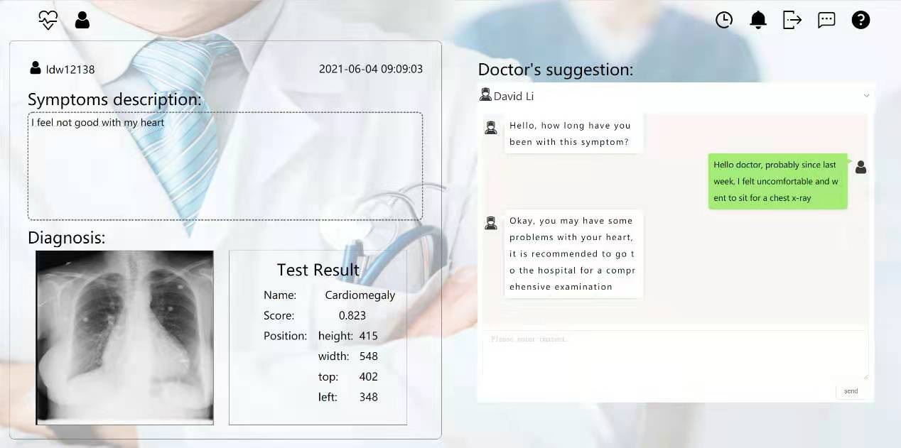
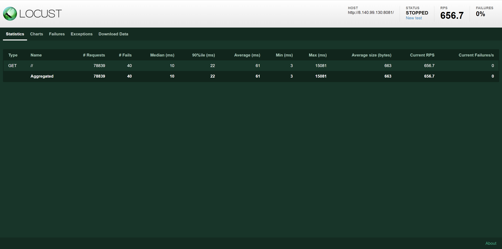
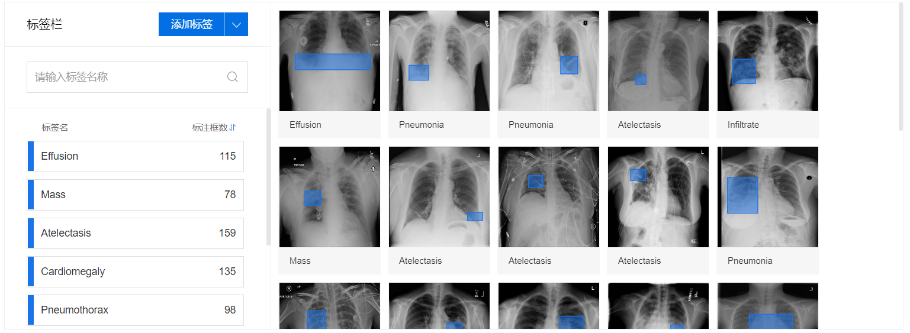

#  Lung Health System

Website(expired): http://8.140.99.130:8081/

Team member: David Li, Zongxuan Shi, Hao Zhang, Renhao Zhang




## 1. System Overview

### 1.1 Introduction

We build a **lung health system** with functions including **registration, login, uploading images to obtain predictions and online consultation**.



### 1.2 Installation

1.Client:

(1)  Install `npm`

(2)  Install `Vue/Cli 2`

(3)  Enter client folder and run `npm install` to install all dependency

(4)  Run `npm run dev` in client folder to enter developer environment

 

2.Server:

(1)  Install python3 and build a virtual environment

(2)  Enter server folder and run `pip install -r requirement.txt` to install all dependency

(3)  Install `mysql 8.0` and create a database name `lhsdb` using utf8mb4 encoding

(4)  Run `python manage.py db init` in server folder to initialize database

(5)  Run `python manage.py db migrate` in server folder to migrate database

(6)  Run `python manage.py db upgrade` in server folder to upgrade database

(7)  Run `python run.py` in server folder to run the system


## 2. Design and Function

### 2.1 Database

We use the **flask-sqlalchemy** package, which uses ORM model to simplify our work to create and manipulate our database. The E-R diagram corresponding to our database is as follows:


### 2.2 Local Information and Security

We use **Token (JWT)** to store user information locally, and carry it every time a request is made for identity verification. Compared with cookies, Token does not need to store corresponding information on the server, but is verified according to the agreed decoding method. We store the user's local information in **Vuex**, and also store it in **localStorage** to prevent information loss when refreshing the page.

Our system has the function of remembering the user. If the user chooses `remember me` when logging in, his username and password will be stored in a cookie. Taking into account the information security factors, we used the **crypto-js** library to encrypt the information in the cookie during storage. In addition, the user password stored on the server database is also hashed to prevent the leakage of user privacy in our database.

### 2.3 User Permissions

There are two types of roles, doctor and user, in our system. Their user interfaces and permissions are different. This requires both front-end and back-end to judge user permission. For the front end, we store the user role type information in Vuex, and the content of the page is dynamically displayed according to different roles. For the backend, we judge the user type of each session based on the user's Token to determine which content in our database the user can access.

### 2.4 Websocket

Our system uses **Websocket** to realize the user online consultation function, and uses the **vue-socket.io** and **flask-socketio** libraries. When the user enters the Record page, we generate a unique room_id based on the id of the current record and his user name. At this time, the doctor can send a message to the user based on the room_id and carry his own information. The user can reply and find the doctor’s room_id according to the doctor’s information. The two can start a conversation and consult according to the above method.



### 2.5 Load Test



## 3. Deep Learning Model

### 3.1 Dataset

[Chest x-ray dataset](https://www.nih.gov/news-events/news-releases/nih-clinical-center-provides-one-largest-publicly-available-chest-x-ray-datasets-scientific-community) contains over 100,000 anonymized chest x-ray images which were collected by NIH(National Institutes of Health). It contains 8 kinds of different lung diseases, namely Atelectasis, Cardiomegaly, Effusion, Infiltrate, Mass, Nodule,  Pneumonia and Pneumothorax. We choose 1,000 images as our training dataset.

### 3.2 EasyDL Platform

We choose [EasyDL](https://ai.baidu.com/easydl/) powered by Baidu to train our model. The platform requires `json` format to label the images and provides TeslaGPU_P4_8G to train the model. NIH website offers `BBox_List_2017.csv` which contains the location and the name of different diseases. 

Run `python label.py --dataset=YOUR_DATASET_PATH `, then compress the dataset as a zip file, finally upload it to the EasyDL detection part and start training.



### 3.3 API Test

We use `click` tool to help test our API.

Run `python baidu.py --help` in terminal to get the usage of the function.

```
(base) E:\pycharm\gcp>python baidu.py --help
Usage: baidu.py [OPTIONS]

  Using Baidu EasyDL computer vision API to check what's wrong with your
  lung. The detection API contains 8 different kinds of lung disease:
  Atelectasis, Cardiomegaly, Effusion, Infiltrate, Mass, Nodule, Pneumonia,
  Pneumothorax.

  If the image shows a healthy lung, then a 'None' will return. If certain
  diseases have been found, then a dictionary which includes the location,
  name and confidence of the diseases will return

Options:
  --image TEXT  Input your image path
  --help        Show this message and exit.
```

Then run `python baidu.py --image=YOUR_IMAGE_PATH` to get the result of prediction.

```
(base) E:\pycharm\gcp>python baidu.py --image=004.png
{'location': {'height': 415, 'left': 348, 'top': 402, 'width': 548}, 'name': 'Cardiomegaly', 'score': 0.8231307864189148}
```

